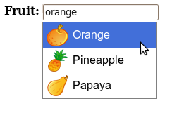

Django AutoComplete Documentation
=================================

Django AutoComplete helps you providing `autocompletion`_ for your input tags.
You can easily make Django AutoComplete work with any javascript toolkit,
although only `YUI`_ and `JQuery`_ are supported by default.

.. _`autocompletion`: http://developer.yahoo.com/ypatterns/selection/autocomplete.html
.. _`YUI`: http://developer.yahoo.com/yui/
.. _`JQuery`: http://jquery.com/

.. toctree::

   installation
   handling-relationships
   handling-suggestions

   library/fields
   library/views
   library/widgets

Indices and tables
==================

* :ref:`genindex`
* :ref:`modindex`
* :ref:`search`

